# 🌊 github-ripple

Turn your repo's contributors into pixel-art characters drifting on tubes across a wavy ocean — rendered as an animated SVG in your README.

## Contributors



---

## Usage

Add this workflow to your repo at `.github/workflows/ripple.yml`:

```yaml
name: Ripple
on:
  schedule:
    - cron: '0 0 * * 0'
  workflow_dispatch:
  push:
    branches: [master, main]

permissions:
  contents: write

jobs:
  splash:
    runs-on: ubuntu-latest
    steps:
      - uses: actions/checkout@v4
      - uses: coitloz88/github-ripple@v1
        with:
          output-path: assets/ripple.svg
      - uses: stefanzweifel/git-auto-commit-action@v5
        with:
          commit_message: '🌊 ripple update'
          file_pattern: 'assets/ripple.svg'
```

Then embed in your `README.md`:

```markdown

```

> **Settings → Actions → General → Workflow permissions** must be set to **Read and write permissions** so the action can commit the generated SVG.

## Inputs

| Input | Default | Description |
| --- | --- | --- |
| `output-path` | `assets/ripple.svg` | Where to write the generated SVG (relative to repo root) |
| `max-contributors` | `20` | Max contributors shown, sorted by contribution count |
| `exclude-bots` | `false` | Skip accounts whose login ends with `[bot]`. By default bots are included — they appear as UFOs. |
| `pins` | `''` | Comma-separated synthetic contributors. Format: `login` or `login=avatar-url`. E.g. `claude=https://github.com/anthropics.png,jules` |
| `token` | `${{ github.token }}` | GitHub token used for the API call |

The scene cycles through night → dawn → day → sunset → night continuously. The SVG is only committed when the contributor list actually changes, so the workflow runs weekly without generating noise commits.

Pinned contributors are always rendered (even if no commits in the repo) and dedupe against real contributors by login. Use this to add mascots, AI assistants you collaborate with, or any persona you want floating in your ocean.

## Run locally

```bash
pnpm install
export GITHUB_TOKEN=ghp_yourtoken
pnpm tsx scripts/generate.ts --owner=<owner> --repo=<repo> --output=test-output/test.svg
```

Open the resulting SVG in a browser to preview the animation.

## How it works

- Three wave layers scroll horizontally at different speeds (parallax)
- Each contributor gets a **vehicle** determined by their login hash:
  - **Tube** (default) — floating on the water with a round avatar bubble
  - **UFO** (1-in-15 chance for humans, always for bots) — smooth saucer with avatar in the dome, blinking lights, and a tractor beam. 20% of UFOs fly through the sky instead of floating on the water
- Bots (`login` ending in `[bot]`) always get a UFO, rendered at 70% scale
- Position, color, speed, and bob phase are hashed deterministically from the login, so the same person always looks the same
- Avatars are fetched at 64×64 and rendered at 30×30 (tube) or 14×14 (UFO dome)
- All info is always visible — SVGs embedded in READMEs via `` don't get hover/click

## License

MIT
